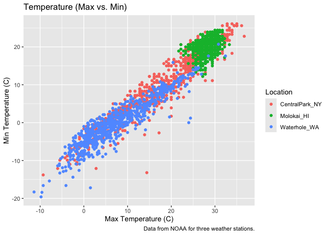
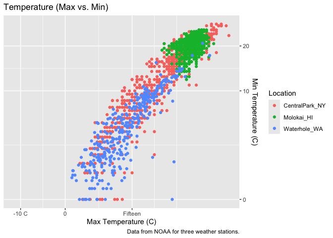
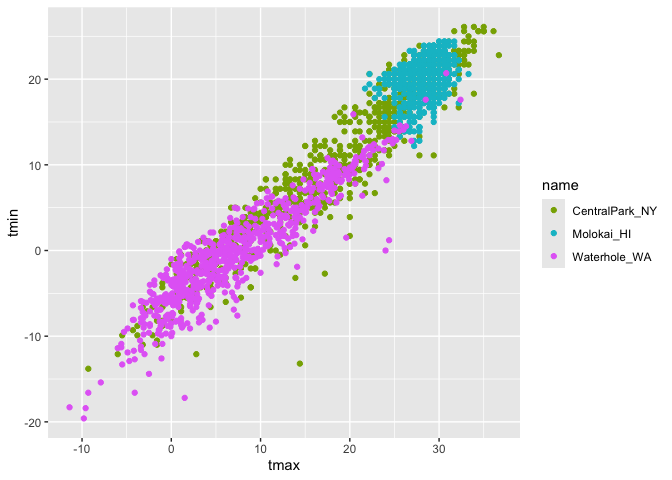

02_viz
================
Emma
2026-10-06

# Lecture Notes

How data organization and manipulation feeds into making plots. A good
picture is worth 1000 words! \* Critical to look at datasets before
making figures

To have a good picture:

- Show as much of the data as you can
- avoid superfluous frills (eg. 3D)
- Facilitate comparisons
- Put groups in sensible order
- use common axes
- use a color to highlight groups
- no pie charts (make a bar chart instead)

Good pictures are not necessarily publication quality. Most figures are
for you, and these should still be good. Publication figures take much
more time.

Using ggplot: Basic graph components

- data, aesthetic mappings, geoms

Advanced graph components

- facets, statistics, scales

A graph is built by combining these components Graphics can be further
customized depending on the goals

- Axis labels, axis tick locations/labels, font sizes, graphs themes,
  color scales, combining panels

Based around the “tidy data” framework Trouble making a plot is often
trouble with data tidiness in disguise

- think about your data organization and how it affects your ability to
  visualize
- Factors can help with ordering

# Time to make some more complicated plots!

``` r
library(tidyverse)
```

    ## ── Attaching core tidyverse packages ──────────────────────── tidyverse 2.0.0 ──
    ## ✔ dplyr     1.2.1     ✔ readr     2.2.0
    ## ✔ forcats   1.0.1     ✔ stringr   1.6.0
    ## ✔ ggplot2   4.0.3     ✔ tibble    3.3.1
    ## ✔ lubridate 1.9.5     ✔ tidyr     1.3.2
    ## ✔ purrr     1.2.2     
    ## ── Conflicts ────────────────────────────────────────── tidyverse_conflicts() ──
    ## ✖ dplyr::filter() masks stats::filter()
    ## ✖ dplyr::lag()    masks stats::lag()
    ## ℹ Use the conflicted package (<http://conflicted.r-lib.org/>) to force all conflicts to become errors

``` r
library(p8105.datasets)

data("weather_df") 
```

``` r
weather_df |> 
  ggplot(aes(x = tmax, y = tmin, color = name)) + 
  geom_point() +
  labs(
    title = "Temperature (Max vs. Min)", 
    x = "Max Temperature (C)", 
    y = "Min Temperature (C)", 
    color = "Location",
    caption = "Data from NOAA for three weather stations."
  )
```

    ## Warning: Removed 17 rows containing missing values or values outside the scale range
    ## (`geom_point()`).

<!-- --> Labeling
axes, adding captions, etc. Jeff does not bother with labels in graphs
for himself, just for other people. Still helpful.

Let’s try some other scales.

``` r
weather_df |> 
  ggplot(aes(x = tmax, y = tmin, color = name)) + 
  geom_point() +
  labs(
    title = "Temperature (Max vs. Min)", 
    x = "Max Temperature (C)", 
    y = "Min Temperature (C)", 
    color = "Location",
    caption = "Data from NOAA for three weather stations."
  ) + 
  scale_x_continuous(
    breaks = c (-10, 0, 15), 
    labels = c("-10 C", "0", "Fifteen")
  ) + 
  scale_y_continuous(
    trans = "sqrt",
    position = "right"
  )
```

    ## Warning in transformation$transform(x): NaNs produced

    ## Warning in scale_y_continuous(trans = "sqrt", position = "right"): sqrt
    ## transformation introduced infinite values.

    ## Warning: Removed 520 rows containing missing values or values outside the scale range
    ## (`geom_point()`).

<!-- --> Can control
scale depending on the variable. different scale functions. This changes
the scale on the x axis. You can also label the scales on the axes. Can
also do transformations (square root), and change position of axis
labels (eg. y axis label from left side to right side).

Let’s look at color! Jeff uses this scale all the time.

``` r
weather_df |> 
  ggplot(aes(x = tmax, y = tmin, color = name)) +
  geom_point() +
  scale_color_hue(h = c(100, 300)) 
```

    ## Warning: Removed 17 rows containing missing values or values outside the scale range
    ## (`geom_point()`).

<!-- -->

use the viridis color palette for pretty much everything:

``` r
weather_df |> 
  ggplot(aes(x = tmax, y = tmin, color = name)) +
  geom_point() +
  viridis::scale_color_viridis(
    name = "Location",
    discrete = TRUE
  )
```

    ## Warning: Removed 17 rows containing missing values or values outside the scale range
    ## (`geom_point()`).

<!-- --> Have to say
whether variable is discrete or continuous
