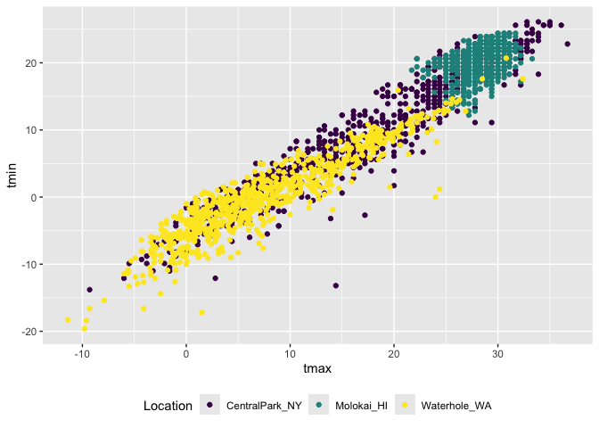
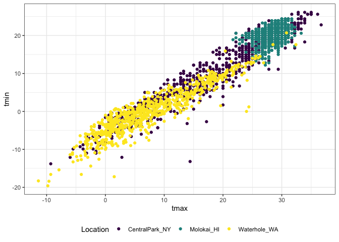
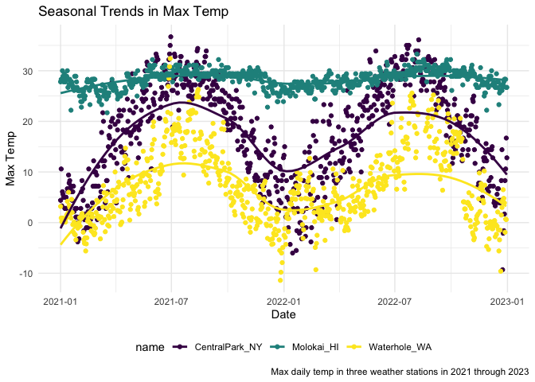
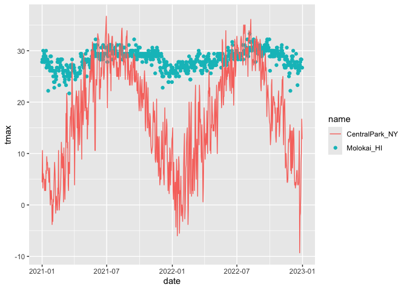
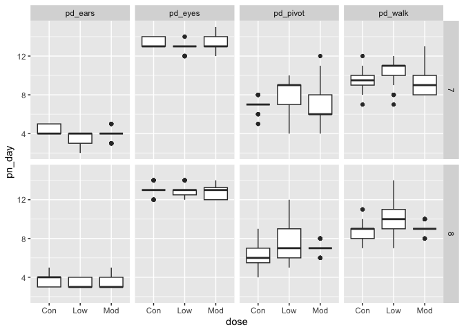

02_viz
================
Emma
2026-10-06

# Lecture Notes

How data organization and manipulation feeds into making plots. A good
picture is worth 1000 words! \* Critical to look at datasets before
making figures

To have a good picture:

- Show as much of the data as you can
- avoid superfluous frills (eg. 3D)
- Facilitate comparisons
- Put groups in sensible order
- use common axes
- use a color to highlight groups
- no pie charts (make a bar chart instead)

Good pictures are not necessarily publication quality. Most figures are
for you, and these should still be good. Publication figures take much
more time.

Using ggplot: Basic graph components

- data, aesthetic mappings, geoms

Advanced graph components

- facets, statistics, scales

A graph is built by combining these components Graphics can be further
customized depending on the goals

- Axis labels, axis tick locations/labels, font sizes, graphs themes,
  color scales, combining panels

Based around the “tidy data” framework Trouble making a plot is often
trouble with data tidiness in disguise

- think about your data organization and how it affects your ability to
  visualize
- Factors can help with ordering

# Time to make some more complicated plots!

``` r
library(tidyverse)
```

    ## ── Attaching core tidyverse packages ──────────────────────── tidyverse 2.0.0 ──
    ## ✔ dplyr     1.2.1     ✔ readr     2.2.0
    ## ✔ forcats   1.0.1     ✔ stringr   1.6.0
    ## ✔ ggplot2   4.0.3     ✔ tibble    3.3.1
    ## ✔ lubridate 1.9.5     ✔ tidyr     1.3.2
    ## ✔ purrr     1.2.2     
    ## ── Conflicts ────────────────────────────────────────── tidyverse_conflicts() ──
    ## ✖ dplyr::filter() masks stats::filter()
    ## ✖ dplyr::lag()    masks stats::lag()
    ## ℹ Use the conflicted package (<http://conflicted.r-lib.org/>) to force all conflicts to become errors

``` r
library(p8105.datasets)
library(patchwork)

data("weather_df") 
```

Patchwork allows you to stitch together plots.

``` r
weather_df |> 
  ggplot(aes(x = tmax, y = tmin, color = name)) + 
  geom_point() +
  labs(
    title = "Temperature (Max vs. Min)", 
    x = "Max Temperature (C)", 
    y = "Min Temperature (C)", 
    color = "Location",
    caption = "Data from NOAA for three weather stations."
  )
```

    ## Warning: Removed 17 rows containing missing values or values outside the scale range
    ## (`geom_point()`).

<!-- --> Labeling
axes, adding captions, etc. Jeff does not bother with labels in graphs
for himself, just for other people. Still helpful.

Let’s try some other scales.

``` r
weather_df |> 
  ggplot(aes(x = tmax, y = tmin, color = name)) + 
  geom_point() +
  labs(
    title = "Temperature (Max vs. Min)", 
    x = "Max Temperature (C)", 
    y = "Min Temperature (C)", 
    color = "Location",
    caption = "Data from NOAA for three weather stations."
  ) + 
  scale_x_continuous(
    breaks = c (-10, 0, 15), 
    labels = c("-10 C", "0", "Fifteen")
  ) + 
  scale_y_continuous(
    trans = "sqrt",
    position = "right"
  )
```

    ## Warning in transformation$transform(x): NaNs produced

    ## Warning in scale_y_continuous(trans = "sqrt", position = "right"): sqrt
    ## transformation introduced infinite values.

    ## Warning: Removed 520 rows containing missing values or values outside the scale range
    ## (`geom_point()`).

<!-- --> Can control
scale depending on the variable. different scale functions. This changes
the scale on the x axis. You can also label the scales on the axes. Can
also do transformations (square root), and change position of axis
labels (eg. y axis label from left side to right side).

Let’s look at color! Jeff uses this scale all the time.

``` r
weather_df |> 
  ggplot(aes(x = tmax, y = tmin, color = name)) +
  geom_point() +
  scale_color_hue(h = c(100, 300)) 
```

    ## Warning: Removed 17 rows containing missing values or values outside the scale range
    ## (`geom_point()`).

<!-- -->

use the viridis color palette for pretty much everything:

``` r
weather_df |> 
  ggplot(aes(x = tmax, y = tmin, color = name)) +
  geom_point() +
  viridis::scale_color_viridis(
    name = "Location",
    discrete = TRUE
  )
```

    ## Warning: Removed 17 rows containing missing values or values outside the scale range
    ## (`geom_point()`).

<!-- --> Have to say
whether variable is discrete or continuous

## Themes

``` r
weather_df |> 
  ggplot(aes(x = tmax, y = tmin, color = name)) +
  geom_point() +
  viridis::scale_color_viridis(
    name = "Location",
    discrete = TRUE
  ) +
  theme(legend.position = "bottom") 
```

    ## Warning: Removed 17 rows containing missing values or values outside the scale range
    ## (`geom_point()`).

<!-- --> Changing the
position of the legend to the bottom.

``` r
weather_df |> 
  ggplot(aes(x = tmax, y = tmin, color = name)) +
  geom_point() +
  viridis::scale_color_viridis(
    name = "Location",
    discrete = TRUE
  ) +
  theme_bw() +
  theme(legend.position = "bottom") 
```

    ## Warning: Removed 17 rows containing missing values or values outside the scale range
    ## (`geom_point()`).

<!-- --> bw gives you
white background, grey lines. Can also do theme_minimal (no box around
plot), theme_classic (no lines inside plot). HAVE to put theme_bw (or
whichever) first, it overrides all other theme commands.

Update the tmax vs. date plot.

``` r
weather_df |> 
  ggplot(aes(x = date, y = tmax, color = name)) +
  geom_point() +
  geom_smooth(se = FALSE) +
  labs(
    title = "Seasonal Trends in Max Temp", 
    x = "Date",
    y = "Max Temp",
    caption = "Max daily temp in three weather stations in 2021 through 2023"
  ) +
  viridis::scale_color_viridis(
    discrete = TRUE
  ) + 
  theme_minimal() + 
  theme(legend.position = "bottom")
```

    ## `geom_smooth()` using method = 'loess' and formula = 'y ~ x'

    ## Warning: Removed 17 rows containing non-finite outside the scale range
    ## (`stat_smooth()`).

    ## Warning: Removed 17 rows containing missing values or values outside the scale range
    ## (`geom_point()`).

<!-- -->

## Two more weird but useful plot things

``` r
central_park_df = 
  weather_df |> 
  filter(name == "CentralPark_NY")

molokai_df = 
  weather_df |> 
  filter(name == "Molokai_HI")

ggplot(molokai_df, aes(x = date, y = tmax, color = name)) +
  geom_point() +
  geom_line(data = central_park_df)
```

    ## Warning: Removed 1 row containing missing values or values outside the scale range
    ## (`geom_point()`).

<!-- --> Adding two
separate datasets into same plot. Overlaying line plot from second data
frame onto scatter plot.

Multiple panels of your different plots: Use Patchwork!

``` r
ggp_tmax_tmin = 
  weather_df |> 
  ggplot(aes(x = tmin, y = tmax, color = name)) +
  geom_point() +
  theme(legend.position = "none")

ggp_prcp_density = 
  weather_df |> 
  filter(prcp > 0) |> 
  ggplot(aes(x = prcp, fill = name)) +
  geom_density(alpha = .5) +
  theme(legend.position = "none")

ggp_seasonal = 
  weather_df |> 
  ggplot(aes(x = date, y = tmax, color = name)) +
  geom_point() +
  theme(legend.position = "bottom")

(ggp_tmax_tmin + ggp_prcp_density) / ggp_seasonal
```

    ## Warning: Removed 17 rows containing missing values or values outside the scale range
    ## (`geom_point()`).
    ## Removed 17 rows containing missing values or values outside the scale range
    ## (`geom_point()`).

<!-- --> Change the
legend position to make less crowded.

## Data manipulation

Start with factors. Factor variables are doing some important stuff!

boxplots!

``` r
weather_df |> 
  mutate(name = factor(name)) |> ## R does this in the background automatically, don't do
  ggplot(aes(x = name, y = tmax)) +
  geom_boxplot()
```

    ## Warning: Removed 17 rows containing non-finite outside the scale range
    ## (`stat_boxplot()`).

<!-- --> Puts factor
variables alphabetically automatically along axes. you can be more
explicit.

``` r
weather_df |> 
  mutate(name = fct_relevel(name, c("Molokai_HI", "CentralPark_NY", "Waterhole_WA"))) |>
  ggplot(aes(x = name, y = tmax)) +
  geom_boxplot()
```

    ## Warning: Removed 17 rows containing non-finite outside the scale range
    ## (`stat_boxplot()`).

<!-- --> You started
with some levels, what order do you want them in? This puts molokai
first, CP second, WW third

``` r
weather_df |> 
  mutate(name = fct_reorder(name, tmax)) |>
  ggplot(aes(x = name, y = tmax)) +
  geom_boxplot()
```

    ## Warning: There was 1 warning in `mutate()`.
    ## ℹ In argument: `name = fct_reorder(name, tmax)`.
    ## Caused by warning:
    ## ! `fct_reorder()` removing 17 missing values.
    ## ℹ Use `.na_rm = TRUE` to silence this message.
    ## ℹ Use `.na_rm = FALSE` to preserve NAs.

    ## Warning: Removed 17 rows containing non-finite outside the scale range
    ## (`stat_boxplot()`).

<!-- --> Reorder name
variable according to another variable (tmax). For each unique name,
what is median tmax, and arrange those from smallest to largest.
Reordering is not a ggplot problem. That is a factor/data problem, so
you need to mutate the data by reordering the factor variables.

Making Jeff’s imaginary plot

``` r
weather_df |> 
  select(name, tmax, tmin) |> 
  pivot_longer(
    tmax:tmin, 
    names_to = "observation", 
    values_to = "temp"
  ) |> 
  ggplot(aes(x = temp, fill = observation)) +
  geom_density(alpha = 0.5) +
  facet_grid(. ~name)
```

    ## Warning: Removed 34 rows containing non-finite outside the scale range
    ## (`stat_density()`).

<!-- --> Only keep
name, tmax, tmin. Observing t max or observing tmin, values in next
column. facet grid according the name. Tidy data in some cases when you
want to make specific plots

Making Jeff’s second imaginary plot using FAS dataset:

- Start with one panel and go from there

``` r
pups_df = 
  read_csv(
    "data/FAS_pups.csv", skip = 3, na = c("", ".", "NA")) |> 
  janitor:: clean_names()
```

    ## Rows: 313 Columns: 6
    ## ── Column specification ────────────────────────────────────────────────────────
    ## Delimiter: ","
    ## chr (1): Litter Number
    ## dbl (5): Sex, PD ears, PD eyes, PD pivot, PD walk
    ## 
    ## ℹ Use `spec()` to retrieve the full column specification for this data.
    ## ℹ Specify the column types or set `show_col_types = FALSE` to quiet this message.

``` r
litters_df = 
  read_csv(
    "data/FAS_litters.csv", na = c("", ".", "NA")) |> 
  janitor:: clean_names() |> 
  separate(group, into = c("dose", "day_of_tx"), 3)
```

    ## Rows: 49 Columns: 8
    ## ── Column specification ────────────────────────────────────────────────────────
    ## Delimiter: ","
    ## chr (2): Group, Litter Number
    ## dbl (6): GD0 weight, GD18 weight, GD of Birth, Pups born alive, Pups dead @ ...
    ## 
    ## ℹ Use `spec()` to retrieve the full column specification for this data.
    ## ℹ Specify the column types or set `show_col_types = FALSE` to quiet this message.

``` r
fas_df =
  left_join(pups_df, litters_df, by = "litter_number")

fas_df |> #select columns you need from new df 
  select(dose, day_of_tx, starts_with("pd")) |> 
  pivot_longer(
    starts_with("pd"), 
    names_to = "outcome", 
    values_to = "pn_day"
  ) |> 
  drop_na() |> 
  ggplot(aes(x = dose, y = pn_day)) +
  geom_boxplot() +
  facet_grid(day_of_tx ~ outcome) #rows separated by day of tx, columns by outcome
```

<!-- -->
