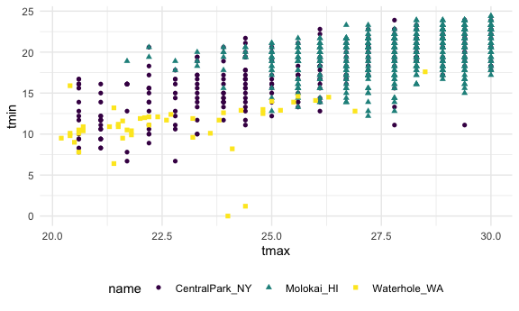

eda
================
Emma
2026-10-08

## Exploratory data analysis

The stuffy between loading data and formal analysis is “exploratory”.
This includes:

- visualization
- checks for data completeness and reliability
- initial evaluation of hypotheses
- hypothesis generation

Current emphasis on creating numeric summaries.

## Grouping

Datasets often consist of groups \* sometimes by design \* sometimes
implied \* sometimes nested

eg. treatment groups, age groups, geographic groups, family units These
are groups you examine visually and quantitatively.

## Grouped summaries

Quantitative comparisons across groups are informative \* measures
center (mean, median) \* measure of variability (SD, variance, IQR)

## Use group_by() and summarize()

group_by() makes grouping explicit and adds a layer to your data \*
based on existing variables \* changes beahvior of some key functions \*
almost invisibile! pay attention

summarize() allows you to compute one-number summaries \* based on
exisiting variables \* most useful in conjunction with group_by() \*
produces a data frame with grouping variables and summaries \* easy to
integrate into a pipeline

Sometimes these are used to make comparisons

## Exploratory data analysis

Most statistical tests assume you’re only concerned about the current
hypothesis, or that you’ve done appropriate adjustments for multiple
comparisons.

The validity of conclusions based on these tests depends on the process
that lead you to a hypothesis. \* with any given dataset, you can form a
huge number of hypotheses \* can only evaluate a small number of those
\* this can blur the line between “exploratory” and “formal” analysis \*
the problem is sometimes referred to as the “garden of the forking
paths”

## Time to code!

This is the code that Jeff uses at the beginning of all of his Rmd. This
sets a figure width, color scheme, and theme for all of the plots made
in this document. You don’t need to do this, but it can be good.

Load the weather data as well.

``` r
data("weather_df")

weather_df = 
  weather_df |> 
  mutate( 
    month = lubridate::floor_date(date, unit = "month")
    )
```

This rounds down all dates to one day in the month (all January dates
rounded down to 01/01)

``` r
weather_df |> 
  filter(prcp >0) |> 
  ggplot(aes(x = prcp)) +
  geom_histogram()
```

    ## `stat_bin()` using `bins = 30`. Pick better value `binwidth`.


Looking for outliers/quality checking:

``` r
weather_df |> 
  filter(prcp > 1000)
```

    ## # A tibble: 3 × 7
    ##   name           id          date        prcp  tmax  tmin month     
    ##   <chr>          <chr>       <date>     <dbl> <dbl> <dbl> <date>    
    ## 1 CentralPark_NY USW00094728 2021-08-21  1130  27.8  22.8 2021-08-01
    ## 2 CentralPark_NY USW00094728 2021-09-01  1811  25.6  17.2 2021-09-01
    ## 3 Molokai_HI     USW00022534 2022-12-18  1120  23.3  18.9 2022-12-01

``` r
weather_df |> 
  filter(tmax > 20, tmax <= 30) |> 
  ggplot(aes(x = tmax, y = tmin, color = name, shape = name)) +
  geom_point()
```


The values here are not continuously distributed (we see vertical bars)
in both NYC and HI, but not WA. Indicates different temp collection
methods across locations. Useful to know! An example of combining
visualization with looking at numbers - plots can be informative.

## Group

``` r
weather_df |> 
  group_by(name)
```

    ## # A tibble: 2,190 × 7
    ## # Groups:   name [3]
    ##    name           id          date        prcp  tmax  tmin month     
    ##    <chr>          <chr>       <date>     <dbl> <dbl> <dbl> <date>    
    ##  1 CentralPark_NY USW00094728 2021-01-01   157   4.4   0.6 2021-01-01
    ##  2 CentralPark_NY USW00094728 2021-01-02    13  10.6   2.2 2021-01-01
    ##  3 CentralPark_NY USW00094728 2021-01-03    56   3.3   1.1 2021-01-01
    ##  4 CentralPark_NY USW00094728 2021-01-04     5   6.1   1.7 2021-01-01
    ##  5 CentralPark_NY USW00094728 2021-01-05     0   5.6   2.2 2021-01-01
    ##  6 CentralPark_NY USW00094728 2021-01-06     0   5     1.1 2021-01-01
    ##  7 CentralPark_NY USW00094728 2021-01-07     0   5    -1   2021-01-01
    ##  8 CentralPark_NY USW00094728 2021-01-08     0   2.8  -2.7 2021-01-01
    ##  9 CentralPark_NY USW00094728 2021-01-09     0   2.8  -4.3 2021-01-01
    ## 10 CentralPark_NY USW00094728 2021-01-10     0   5    -1.6 2021-01-01
    ## # ℹ 2,180 more rows

Defines three groups by name

``` r
weather_df |> 
  group_by(name, month)
```

    ## # A tibble: 2,190 × 7
    ## # Groups:   name, month [72]
    ##    name           id          date        prcp  tmax  tmin month     
    ##    <chr>          <chr>       <date>     <dbl> <dbl> <dbl> <date>    
    ##  1 CentralPark_NY USW00094728 2021-01-01   157   4.4   0.6 2021-01-01
    ##  2 CentralPark_NY USW00094728 2021-01-02    13  10.6   2.2 2021-01-01
    ##  3 CentralPark_NY USW00094728 2021-01-03    56   3.3   1.1 2021-01-01
    ##  4 CentralPark_NY USW00094728 2021-01-04     5   6.1   1.7 2021-01-01
    ##  5 CentralPark_NY USW00094728 2021-01-05     0   5.6   2.2 2021-01-01
    ##  6 CentralPark_NY USW00094728 2021-01-06     0   5     1.1 2021-01-01
    ##  7 CentralPark_NY USW00094728 2021-01-07     0   5    -1   2021-01-01
    ##  8 CentralPark_NY USW00094728 2021-01-08     0   2.8  -2.7 2021-01-01
    ##  9 CentralPark_NY USW00094728 2021-01-09     0   2.8  -4.3 2021-01-01
    ## 10 CentralPark_NY USW00094728 2021-01-10     0   5    -1.6 2021-01-01
    ## # ℹ 2,180 more rows

72 groups –\> 12 months in 3 years x 3

## summarize

``` r
weather_df |> 
  group_by(name, month) |> 
  summarize(count = n())
```

    ## `summarise()` has regrouped the output.
    ## ℹ Summaries were computed grouped by name and month.
    ## ℹ Output is grouped by name.
    ## ℹ Use `summarise(.groups = "drop_last")` to silence this message.
    ## ℹ Use `summarise(.by = c(name, month))` for per-operation grouping
    ##   (`?dplyr::dplyr_by`) instead.

    ## # A tibble: 72 × 3
    ## # Groups:   name [3]
    ##    name           month      count
    ##    <chr>          <date>     <int>
    ##  1 CentralPark_NY 2021-01-01    31
    ##  2 CentralPark_NY 2021-02-01    28
    ##  3 CentralPark_NY 2021-03-01    31
    ##  4 CentralPark_NY 2021-04-01    30
    ##  5 CentralPark_NY 2021-05-01    31
    ##  6 CentralPark_NY 2021-06-01    30
    ##  7 CentralPark_NY 2021-07-01    31
    ##  8 CentralPark_NY 2021-08-01    31
    ##  9 CentralPark_NY 2021-09-01    30
    ## 10 CentralPark_NY 2021-10-01    31
    ## # ℹ 62 more rows

``` r
weather_df |> 
  count(name, month)
```

    ## # A tibble: 72 × 3
    ##    name           month          n
    ##    <chr>          <date>     <int>
    ##  1 CentralPark_NY 2021-01-01    31
    ##  2 CentralPark_NY 2021-02-01    28
    ##  3 CentralPark_NY 2021-03-01    31
    ##  4 CentralPark_NY 2021-04-01    30
    ##  5 CentralPark_NY 2021-05-01    31
    ##  6 CentralPark_NY 2021-06-01    30
    ##  7 CentralPark_NY 2021-07-01    31
    ##  8 CentralPark_NY 2021-08-01    31
    ##  9 CentralPark_NY 2021-09-01    30
    ## 10 CentralPark_NY 2021-10-01    31
    ## # ℹ 62 more rows

this does same thing

``` r
weather_df |> 
  group_by(month) |> 
  summarize(
    count = n(),
    n_days = n_distinct(date))
```

    ## # A tibble: 24 × 3
    ##    month      count n_days
    ##    <date>     <int>  <int>
    ##  1 2021-01-01    93     31
    ##  2 2021-02-01    84     28
    ##  3 2021-03-01    93     31
    ##  4 2021-04-01    90     30
    ##  5 2021-05-01    93     31
    ##  6 2021-06-01    90     30
    ##  7 2021-07-01    93     31
    ##  8 2021-08-01    93     31
    ##  9 2021-09-01    90     30
    ## 10 2021-10-01    93     31
    ## # ℹ 14 more rows

How many observations are there in 2021 across three weather stations -
how many distinct days?

DON’T do this!!!!

``` r
weather_df |> 
  pull(tmax) |> 
  summary()
```

Can’t do anything useful with this object. Not a dataframe. Don’t use
tables

DO this instead:

``` r
weather_df |> 
  group_by(name) |> 
  summarize(
    mean_tmax = mean(tmax, na.rm = TRUE), 
    median_tmax = median(tmax, na.rm = TRUE),
    sd_prcp = sd(prcp, na.rm = TRUE), 
    q25_prcp = quantile(prcp, 0.25, na.rm = TRUE), 
    q95_prcp = quantile(prcp, 0.95, na.rm = TRUE)
  )
```

    ## # A tibble: 3 × 6
    ##   name           mean_tmax median_tmax sd_prcp q25_prcp q95_prcp
    ##   <chr>              <dbl>       <dbl>   <dbl>    <dbl>    <dbl>
    ## 1 CentralPark_NY     17.7         18.9   113.         0      198
    ## 2 Molokai_HI         28.3         28.3    63.2        0       41
    ## 3 Waterhole_WA        7.38         6.1   111.         0      279

Computes mean tmax value in each of the weather stations I’m interested
in. Can choose what you’re interested in reporting and make the
summarize tables however you want. Also looking at 25% percentile (0
because most of the time it is not raining) and 95% percentile.

``` r
weather_df |> 
  group_by(name) |> 
  summarize(
    mean_tmax = mean(tmax, na.rm = TRUE), 
    median_tmax = median(tmax, na.rm = TRUE),
    sd_prcp = sd(prcp, na.rm = TRUE), 
    q25_prcp = quantile(prcp, 0.25, na.rm = TRUE), 
    q95_prcp = quantile(prcp, 0.95, na.rm = TRUE)
  ) |> 
  knitr::kable(digits = 2)
```

| name           | mean_tmax | median_tmax | sd_prcp | q25_prcp | q95_prcp |
|:---------------|----------:|------------:|--------:|---------:|---------:|
| CentralPark_NY |     17.66 |        18.9 |  113.40 |        0 |      198 |
| Molokai_HI     |     28.32 |        28.3 |   63.24 |        0 |       41 |
| Waterhole_WA   |      7.38 |         6.1 |  110.81 |        0 |      279 |

This makes a nicely formatted table, good if you’re making for someone
else to look at.

``` r
weather_df |> 
  group_by(name, month) |> 
  summarize(
    mean_tmax = mean(tmax, na.rm = TRUE)
  ) |> 
  pivot_wider(
    names_from = name, 
    values_from = mean_tmax
  ) |> 
  knitr::kable(digits = 2)
```

    ## `summarise()` has regrouped the output.
    ## ℹ Summaries were computed grouped by name and month.
    ## ℹ Output is grouped by name.
    ## ℹ Use `summarise(.groups = "drop_last")` to silence this message.
    ## ℹ Use `summarise(.by = c(name, month))` for per-operation grouping
    ##   (`?dplyr::dplyr_by`) instead.

| month      | CentralPark_NY | Molokai_HI | Waterhole_WA |
|:-----------|---------------:|-----------:|-------------:|
| 2021-01-01 |           4.27 |      27.62 |         0.80 |
| 2021-02-01 |           3.87 |      26.37 |        -0.79 |
| 2021-03-01 |          12.29 |      25.86 |         2.62 |
| 2021-04-01 |          17.61 |      26.57 |         6.10 |
| 2021-05-01 |          22.08 |      28.58 |         8.20 |
| 2021-06-01 |          28.06 |      29.59 |        15.25 |
| 2021-07-01 |          28.35 |      29.99 |        17.34 |
| 2021-08-01 |          28.81 |      29.52 |        17.15 |
| 2021-09-01 |          24.79 |      29.67 |        12.65 |
| 2021-10-01 |          19.93 |      29.13 |         5.48 |
| 2021-11-01 |          11.54 |      28.85 |         3.53 |
| 2021-12-01 |           9.59 |      26.19 |        -2.10 |
| 2022-01-01 |           2.85 |      26.61 |         3.61 |
| 2022-02-01 |           7.65 |      26.83 |         2.99 |
| 2022-03-01 |          11.99 |      27.73 |         3.42 |
| 2022-04-01 |          15.81 |      27.72 |         2.46 |
| 2022-05-01 |          22.25 |      28.28 |         5.81 |
| 2022-06-01 |          26.09 |      29.16 |        11.13 |
| 2022-07-01 |          30.72 |      29.53 |        15.86 |
| 2022-08-01 |          30.50 |      30.70 |        18.83 |
| 2022-09-01 |          24.92 |      30.41 |        15.21 |
| 2022-10-01 |          17.43 |      29.22 |        11.88 |
| 2022-11-01 |          14.02 |      27.96 |         2.14 |
| 2022-12-01 |           6.76 |      27.35 |        -0.46 |

24 months in each of 3 locations = 72. What is going on in January and i
can compare across locations. Making it untidy here because it will be
for others to view.

What about looking at this? This is a good structure for ggplot!

``` r
weather_df |> 
  group_by(name, month) |> 
  summarize(
    mean_tmax = mean(tmax, na.rm = TRUE)
  ) |> 
  ggplot(aes(x = month, y = mean_tmax, color = name)) + 
  geom_point() + 
  geom_line()
```

    ## `summarise()` has regrouped the output.
    ## ℹ Summaries were computed grouped by name and month.
    ## ℹ Output is grouped by name.
    ## ℹ Use `summarise(.groups = "drop_last")` to silence this message.
    ## ℹ Use `summarise(.by = c(name, month))` for per-operation grouping
    ##   (`?dplyr::dplyr_by`) instead.


Showing that group_by and summarize make a dataframe! you can make plots
with it! Sometimes cleaning it up like this can make trends more
apparent (but not always).
